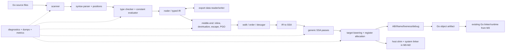

# Rust 重写 Go 1.27.1 编译器：架构设计

> 状态：设计基线。实现前先维护本文件；每个阶段完成后，只追加已验证的事实和决策，不把推测写成实现现状。

## 1. 目标与边界

本项目的目标是用 Rust 从零实现 Go 1.27.1 `cmd/compile` 的等价编译能力，并把实现过程组织成可阅读、可复现的编译器课程。这里的“1:1”有可验收的定义：同一 Go 版本语言输入、编译选项、目标三元组和依赖包下，Rust 编译器应产生等价的诊断、可链接对象语义、导出数据语义、调试信息语义和优化可观察结果；允许对象文件内部布局或临时符号名不同，但不允许改变 Go 程序行为、ABI 或 Go 工具链可观察的约定。

范围只重写 `cmd/compile`。M0-M2 用极小宿主 shim 和系统工具验证完整的原生可执行路径，此时不声称 Go ABI 或 Go 对象兼容；M3 起实现真实 Go `ABIInternal`、对象和 GC 元数据，交由现有 Go 1.27.1 linker/runtime 消费。待编译器契约稳定后，另行评估是否需要重写 `cmd/asm`、`cmd/link`。后端的指令选择、寄存器分配、栈帧、编码及对象输出由 Rust 手动实现；LLVM 可以用作对照实验，不能代替最终后端。

仓库中的 `go_source_code/` 是只读事实基线。现有整理文档是导航资料，不是规范的替代品：实现遇到冲突时，以 Go 1.27.1 源码、测试和语言规范为准，并在日志中记录冲突。

### 用户请求与附件约束的区别

| 来源 | 约束内容 | 对本计划的处理 |
|---|---|---|
| 用户请求 | Rust 从零重写 Go 编译器、架构先行、多维细分、TDD、覆盖 Go 测试、每个功能写测试/性能/风险/经验、生成教学文档和日志 | 定义项目目标、架构、任务卡、阶段门和交付物 |
| 仓库 `AGENTS.md` | 使用简体中文；`go_source_code/` 只读；引用源码带文件:行号；不要编译/测试整棵 Go 源码树；生成文档放 `doc/`；区分教材目录和 Go 源码内 `doc/` | 定义工作方式、证据格式和文件边界，不改变 Rust 重写目标 |
| `doc/go_compiler_tests.md` | 已整理的 Go 测试分层、入口和指令语义 | 作为测试矩阵的事实来源，不把它误当成用户另行要求的新功能 |
| `doc/go_book_mapping.md` / `doc/go_layout.md` | 源码与教材章节、目录地图 | 作为学习路线和源码定位导航，不替代 Go 源码行为规范 |

## 2. 基线事实

- 版本基线：`go_source_code/VERSION` 为 `go1.27.1`。
- `cmd/compile` 官方导览位于 `go_source_code/src/cmd/compile/README.md`，描述 parsing、type checking、noding、middle end、walk、generic SSA、machine code 七段主链。
- 当前源码树中 `cmd/compile/internal` 有约 549 个非测试 Go 文件；`go_source_code/test` 有约 3400 个 `.go` 文件，其中 `test/codegen` 约 87 个是子集。这些是文件规模，不能当作独立测试、断言或通过数；testdir 只枚举指定目录的直属 `.go`（`src/cmd/internal/testdir/testdir_test.go:74` `dirs`、`:170` `goFiles`）。
- 测试入口是 `go_source_code/src/cmd/internal/testdir/testdir_test.go`；测试文件首行指令覆盖 `run`、`compile`、`errorcheck`、`asmcheck`、`build`、`link` 等模式。`doc/go_compiler_tests.md` 已把测试分为 L1 端到端、L2 汇编断言、L3 编译器微测试、L4 包单测、L5 CLI 脚本五层。
- 书本章节与源码映射以 `doc/go_book_mapping.md` 为导航；`doc/chapters/ch01` 至 `ch13` 和附录 A/B 分别覆盖扫描、解析、类型、IR、过程抽象、代码形状、优化、数据流、标量优化、指令选择、调度、寄存器分配和 ILOC/数据结构。

## 3. 从约束推导架构

架构不是先挑目录再填代码，而是由以下不变量推导出来。

| 约束 | 推论 | 架构边界 |
|---|---|---|
| 诊断和调试必须保留源位置、宏/泛型实例化来源和行列信息 | 位置不能只存在于 parser；每次 IR 转换都必须携带可回溯锚点 | `source`, `diagnostics`, `debug` 作为跨阶段基础库；IR 节点含 `SpanId` |
| 类型检查后的语义必须独立于具体语法树 | 优化、导入和后端不能依赖 parser AST | `syntax`、`types`、`typed_ir`、`ssa` 采用单向接口；禁止后端反向引用 parser |
| 包编译是增量且有导入边界的 | M6 真正互操作须读写 Go 1.27.1 export/object contract；早期私有格式仅作内部实验 | `package_graph` 和 `export_data` 独立于单包 pipeline |
| 同一语义要服务多个 GOARCH | 通用优化与目标降低必须分离，target-specific 能力通过 trait 注入 | `backend::Target`、`generic_ssa`、`target_lowering` |
| 优化顺序影响对象和诊断 | pass 必须可命名、可单独运行、可 dump、输入输出可校验 | `pass_manager` + `ir_snapshot` + 确定性排序 |
| 任何错误都要可测试且不能导致未捕获 panic | 内部错误、用户诊断、不可达断言分层 | `DiagnosticSink`, `CompileResult`, `InternalError` |
| TDD 要证明测试先失败 | 每个阶段必须有独立 harness 和最小 fixture，不能等整编译器完成 | `tests/unit`, `tests/golden`, `tests/diff`, `tests/runtime`, `tests/codegen` |
| 1:1 覆盖必须能证明没有漏项 | 单一 ground truth 撑不起“零遗漏”：spec 欠描述 PGO/写屏障/ABIInternal/PCLN/escape 诊断，又过描述 runtime 行为；只有三套独立真值两两 diff 才暴露漏项 | `coverage/spec_atoms.toml`、`coverage/impl_atoms.toml`、`coverage/official-tests.toml`，三者三角 diff + 任务 ID 映射 |
| ground truth 必须可由工具再生 | 手抄锚点会漂移（已发现 `dirs` 实在 `testdir_test.go:74`，曾被抄到 `:73` 的 TODO 注释）；spec/impl 清单的“源侧”由脚本生成，人只填归属 | `tools/extract_spec_atoms`、`tools/extract_impl_atoms`、`tools/extract_test_atoms` 三套生成器，CI 校验哈希 |
| 目标平台矩阵必须显式切边界 | 11 个 GOARCH × obj 重写合计 10 万行级（obj/arm64=35k、obj/x86=16k），全做即不可完成；学习项目按 T1/T2/T3 切档，T3 显式 out-of-scope | `coverage/target_tiers.toml`（T1 必须/T2 应做/T3 范围外）+ `scope-excluded` 状态 |
| 学习目标要求能解释每个决策 | 每个模块都要有原理、源码对照、实验和性能记录 | `rust_go_compiler/docs/teaching/`, `doc/devlog/`, 模块 README |
| 每个阶段都要可执行、可差分 | 前端、中端、后端须按同一 Go 能力切片同步扩展 | M0-M8 纵向闭环与横向能力矩阵 |

由此得到的数据流：



## 4. 组件与接口

实现放在仓库根目录的 `rust_go_compiler/`，不与教材文档混在一起。Cargo workspace 采用小 crate 边界：

```text
rust_go_compiler/
  Cargo.toml
  crates/
    source/          // 文件、UTF-8/字节偏移、行列、SpanMap
    diagnostics/     // 结构化诊断、错误恢复、JSON/text 渲染
    syntax/          // scanner、token、parser、syntax AST
    types/           // Go 类型、常量、作用域、方法集、泛型约束
    package/         // package graph、importcfg、初始化顺序
    typed-ir/        // compiler IR、符号表、类型化节点
    export-data/     // Go 1.27.1 unified export 兼容 reader/writer；早期私有格式仅实验
    middle-end/      // inline、devirtualize、escape、PGO summaries
    lowering/        // walk、order、builtin/runtime lowering
    ssa/              // SSA data model、CFG、dominator、pass manager
    codegen/          // generic lowering、intrinsics、machine-independent rules
    targets/          // amd64 first, then 386/arm/arm64/...
    object/           // obj.Prog-equivalent stream、relocations、debug records
    driver/           // go tool compile-compatible CLI and orchestration
  tests/
    fixtures/         // small Go programs and expected diagnostics
    golden/           // AST, typed IR, SSA, export and object snapshots
    diff/             // reference-Go vs Rust compiler comparison
    codegen/          // architecture-tagged assembly assertions
    runtime/          // compile-link-run tests
  coverage/
    features.toml     // 每项语言、编译器与平台能力的归属和状态
    official-tests.toml // 官方用例、断言、平台与移植映射的清单
  docs/teaching/      // implementation-side module lessons
```

稳定的跨 crate 接口如下：

```rust
pub struct CompileRequest {
    pub files: Vec<SourceFile>,
    pub package_path: PackagePath,
    pub target: TargetTriple,
    pub options: CompileOptions,
}

pub trait CompilerStage<I, O> {
    fn run(&self, input: I, ctx: &mut CompileContext) -> Result<O, StageError>;
}

pub trait TargetBackend {
    fn target(&self) -> TargetTriple;
    fn lower(&self, function: SsaFunction, ctx: &mut CodegenContext)
        -> Result<MachineFunction, CodegenError>;
    fn emit_object(&self, unit: ObjectUnit, out: &mut dyn Write)
        -> Result<ObjectArtifact, ObjectError>;
}
```

`CompileContext` 只提供不可变配置、诊断 sink、统计器、导入缓存和 dump sink；阶段不得通过全局可变状态传递语义。所有集合在输出前按稳定 key 排序，确保同样输入得到可复现的文本 dump、export fingerprint 和对象符号顺序。

## 5. 多维分解

任务不是只有“前端/后端”一条轴，而是以下轴的交叉。实施顺序按 [`rust_go_compiler_rewrite_plan.md`](rust_go_compiler_rewrite_plan.md) 的 M0-M8 纵向可执行能力推进；每个任务卡再标注横向坐标。

1. **语言语义轴**：词法、声明、表达式、语句、接口、方法、泛型、内建函数、`go:` 指令、unsafe、常量和初始化。
2. **编译阶段轴**：scanner → parser → type checker → noder → middle end → walk → SSA → target lowering → object/debug。
3. **数据表示轴**：source/Span、syntax AST、typed AST、compiler IR、SSA、machine IR、object/export/debug artifact。
4. **包边界轴**：单文件、单包、多包导入、标准库、循环错误、增量/缓存、泛型跨包实例化。
5. **目标轴**：generic + 三档显式切分 —— T1 必须（amd64/linux）、T2 应做（arm64/linux）、T3 范围外显式声明（386/arm/loong64/mips/mips64/ppc64/riscv64/s390x/wasm，标 `scope-excluded`）。理由：单 `cmd/internal/obj/arm64`=35612 行、`obj/x86`=15992 行，全做不可完成且对学习项目零边际价值。
6. **正确性轴**：单元、golden、差分、汇编、链接运行、属性/模糊、崩溃恢复和诊断稳定性；外加**变异注入差分**（故意改 reference 一个行为验证 harness 能抓到）与**负测试差分**（reference 拒绝的代码 Rust 也必须拒绝）两项，前者证明 harness 有效、后者直击“不该编译却编译过”的遗漏模式。
7. **性能轴**：扫描吞吐、类型检查复杂度、export I/O、峰值内存、pass 时间、并行包编译、缓存命中率、生成代码质量。
8. **教学轴**：每个功能任务另有 `-T` 子任务，写原理、Go 源码定位、Rust 符号、最小实验、真实失败/通过记录、设计决策和性能；里程碑页整合，日志逐任务追加。
9. **测试覆盖轴**：源码/runner 发现、测试 ID、依赖资产、适用平台、执行方式（直接复用/适配/断言意图移植）、首次解锁任务、最终全量门和状态必须逐项可追溯。

例如“泛型方法调用”不能只建一个 parser 任务：它至少跨越 syntax/parser、types2 等价规则、noder、export-data、inline、SSA、每个支持泛型的测试层和教学章节。计划中的任务卡按此交叉维度拆分。

任务级源码关系详见 [`rust_go_compiler_rewrite_plan.md`](rust_go_compiler_rewrite_plan.md) 的“里程碑与官方源码的任务级对照”：按功能列出 Go 文件/行号/符号、Rust 模块、原理、本门边界和后续深化，同时提供源码到任务的反向索引。同一 Go 文件可横跨多门，完成度按函数中的能力分支或规则计算；清单区分 `rewrite/reference/reuse` 和 `planned/partial/verified`。其中编译器依赖的 `cmd/internal/obj`、`goobj` 编码/写对象能力属于 Rust 后端责任，目录位置不能成为免于重写的理由。每门完成须记录真实 Rust 符号、测试 ID 和证据，逐功能教学子任务继承这份映射。

## 6. 功能模式卡

下面的卡片是每个功能点必须遵循的固定格式：功能描述、Go 基线、编译器原理、测试方法、性能、风险、业界经验。开发计划中的任务引用这些卡片，不允许只写“实现某模块”。

### 6.1 Source / diagnostics

- **功能**：字节偏移到行列映射、UTF-8 处理、文件/包位置、错误恢复、文本和机器可读诊断。
- **Go 基线**：`src/cmd/compile/internal/syntax/pos.go`、`syntax/parser.go`；`src/cmd/compile/internal/base`。
- **原理**：区分 source span、synthetic span 和实例化 span；诊断排序按文件偏移和稳定 error code。
- **测试**：非法 UTF-8、CRLF、Unicode 标识符、跨文件错误、错误恢复后继续报错；与 `go tool compile` 逐字/结构化比较。
- **性能**：行表 O(n) 构建，查询 O(1)；诊断只保存引用，不复制源码。
- **风险**：字节偏移与 Unicode 列混淆会污染后续 DWARF；错误信息文案不是稳定 API，应同时断言 code/span/category。
- **经验**：rustc 的 `Span`/diagnostic 分层、LLVM 的 `FileCheck` 可观察输出；保留结构化诊断而不是只比较字符串。

### 6.2 Scanner / token

- **功能**：关键字、标识符、数字/字符/字符串、注释、分号插入、编译器指令。
- **Go 基线**：`src/cmd/compile/internal/syntax/scanner.go:30`、`:88`、`:448`。
- **原理**：有限自动机、最长匹配、字面量进制和转义验证；scanner 不做语法推断。
- **测试**：token golden、每种字面量边界、注释/分号表、随机 Unicode 和非法 escape；覆盖 `test/syntax`。
- **性能**：单次线性扫描，避免每 token 分配；ASCII 快路径，必要时按字节读取再解码 rune。
- **风险**：分号插入和注释位置错误会造成大量级联解析错误；不要把 Go parser 复用为实现。
- **经验**：rustc lexer 的无分配 token 流；LLVM lit 用最小输入文件隔离一个语法行为。

### 6.3 Parser / syntax AST

- **功能**：所有 Go 1.27 语法、错误恢复、位置保真和 pragma 收集。
- **Go 基线**：`src/cmd/compile/internal/syntax/parser.go:430-2887`。
- **原理**：递归下降 + precedence climbing；AST 是源代码结构，不提前执行类型语义。
- **测试**：每个语法构造至少一条成功 golden 和一条失败诊断；`test/syntax`、`test/fixedbugs` 作为回归目录。
- **性能**：arena/typed index 节点池；解析多文件可并行但输出按文件名排序。
- **风险**：错误恢复过度会改变后续 token；AST 设计过度贴近 Go 源码会阻碍 typed IR。
- **经验**：rustc 的 AST/HIR 分层；Go 自身 syntax AST 保留位置但不把它当最终 IR。

### 6.4 Types / constant evaluator

- **功能**：基础类型、命名类型、数组/切片/映射/通道、函数、接口、类型参数、类型集、常量和尺寸。
- **Go 基线**：`src/cmd/compile/internal/types2/check.go:113`、`type.go`、`instantiate.go`、`universe.go`。
- **原理**：符号表和作用域、赋值规则、方法集、接口可实现性、常量任意精度、类型统一和实例化。
- **测试**：`types2` 对应单测、`src/internal/types/testdata` 共享用例、泛型 `test/typeparam`、常量溢出和尺寸 golden。
- **性能**：类型 interning、约束缓存、延迟实例化；避免导入包被重复检查。
- **风险**：类型别名/定义类型、未类型化常量、接口嵌入、递归类型和泛型约束最易错；必须先锁定语义再优化。
- **经验**：rustc trait solver 的分层缓存；不要把“能打印成一样”当成类型相等。

### 6.5 Package graph / import / init order

- **功能**：importcfg、包路径规范化、导入循环、依赖拓扑、init 顺序、标准库 export 缓存。
- **Go 基线**：`src/cmd/compile/internal/noder/import.go:125-330`、`src/cmd/compile/internal/pkginit`。
- **原理**：有向无环包图、深度优先初始化排序、包级符号隔离和 fingerprint 校验。
- **测试**：单包、多包、重复导入、循环、`unsafe`、本地导入错误；运行 `go test cmd/internal/testdir -run='Test/(import|fixedbugs).*'` 对照。
- **性能**：并行编译无环包，import/export 懒加载；缓存 key 包含 Go 版本、目标、选项和源指纹。
- **风险**：初始化顺序错会产生可运行但错误的程序；路径规范化必须防止同一包有多个缓存键。
- **经验**：rustc crate graph 和增量 query；Go unified export 的“深摘要 + 懒解码”适合分布式/增量边界。

### 6.6 Noder / typed IR / unified export

- **功能**：把 syntax + type information 转为 compiler IR，读写跨包 export data，支持内联体和泛型体。
- **Go 基线**：`src/cmd/compile/internal/noder/noder.go:27`、`unified.go:156-469`、`export.go`、`import.go`。
- **原理**：类型化节点、符号表、对象图序列化、索引和版本/目标验证；能与 Go `.a` 互操作时才算达到正式导出边界，私有 fingerprint 不是 Go 格式的替代品。
- **测试**：IR golden、export round-trip、损坏/截断/版本不匹配、跨包泛型和内联；与 `.a`/export 输出做语义比较。
- **性能**：索引化 section、mmap/按需解码、避免导出未使用函数体；记录包级 I/O 和解码时间。
- **风险**：格式一旦公开就难以变更；必须写格式版本和迁移拒绝策略，禁止 silent fallback。
- **经验**：rustc metadata/`TyCtxt` 的 query 边界；Go unified IR 代码中的 stub/body 分阶段写出策略。

### 6.7 Middle end: inline / devirtualize / escape / PGO

- **功能**：函数内联、接口去虚拟化、逃逸分析、PGO 热点和内联属性传播。
- **Go 基线**：`src/cmd/compile/internal/inline/inl.go:163`、`escape/solve.go:19`、`devirtualize`、`pgoir`。
- **原理**：调用图、成本模型、约束图/数据流、热度摘要；每个 pass 产出可解释 reason。
- **测试**：`-m`/优化日志 golden、逃逸结果、内联边界、PGO fixture、语义等价 runtime tests。
- **性能**：工作列表和 SCC 缓存；限制诊断字符串构造；PGO 数据按 profile fingerprint 缓存。
- **风险**：优化结果依赖顺序，错误会是静默性能回退或语义错误；默认先保证 no-opt 正确，再逐 pass 打开。
- **经验**：rustc MIR pass 的显式阶段和 debug dump；LLVM 以 pass pipeline 可追踪性换取可调优性。

### 6.8 Walk / order / builtin lowering

- **功能**：求值顺序、临时变量、`range`、`switch`、map/channel/closure/defer/go/copy 等高层构造降级。
- **Go 基线**：`src/cmd/compile/internal/walk/walk.go:24`、`order.go`、`range.go`、`builtin.go`。
- **原理**：保持副作用顺序和可观察 panic；将语言构造改写成 runtime ABI 调用和简单控制流。
- **测试**：副作用顺序、panic/短路、map/channel/closure/range runtime tests；IR snapshot 证明每种 lowering。
- **性能**：只在需要时创建临时对象；对小常量和内建函数走 intrinsic/inline 快路径。
- **风险**：错误的重排是最危险的语义 bug；每条 lowering 规则都要有反例和 runtime oracle。
- **经验**：MLIR dialect lowering 的逐层合法性检查；保持每层 IR 可验证。

### 6.9 SSA core / generic passes

- **功能**：CFG、值/块、phi、memory token、支配树、SSA 构建、DCE、CSE、prove、nil/bounds check、循环优化。
- **Go 基线**：`src/cmd/compile/internal/ssagen/ssa.go`、`ssagen/phi.go`、`ssa/compile.go`、`ssa/dom.go`、`ssa/_gen/*.rules`。
- **原理**：SSA 单赋值、支配关系、数据流方程、内存依赖 token；规则文件是生成源，生成 `.go` 是产物。
- **测试**：SSA builder 单测、每个 pass 的最小 before/after golden、验证器、随机 CFG/property；绝不手改 Go 生成产物作为依据。
- **性能**：稀疏集合、整数 ID、函数级 pass；针对大函数记录每 pass 时间和峰值值数。
- **风险**：phi/memory token 错会导致错误代码；每个 pass 必须先验证输入/后验证输出，失败时 dump 完整函数。
- **经验**：Go SSA 的 ID 化表示和 Cranelift block parameter；Cranelift 文本 IR 适合作为教学和回归格式。

### 6.10 Targets / ABI / register allocation / debug

- **功能**：generic-to-machine lowering、指令选择、寻址模式、寄存器分配、栈帧、调用约定、GC safe point、DWARF/PCLN。
- **Go 基线**：`src/cmd/compile/internal/ssa/_gen/{AMD64,ARM64,...}.rules`、各 target 目录、`src/cmd/compile/internal/abi`、`liveness`、`dwarfgen`、`objw`。
- **原理**：目标描述、合法化、寄存器分配、栈布局、活跃性、位置列表和调试映射；Go `ABIInternal` 的寄存器和保存约定须按 `src/cmd/compile/abi-internal.md:109`、`:221`，不能套用平台 C ABI。
- **测试**：先 amd64 汇编断言和对象链接运行，再逐架构 `test/codegen`、ABI、DWARF、`go tool objdump` 对照；每架构有 capability manifest。
- **性能**：规则生成而非运行时字符串匹配；寄存器分配和指令选择记录 spill、block/value 数和编译时间。
- **风险**：ABI、写屏障、栈增长、寄存器保存、端序和浮点边界错误会直接破坏运行时；每次扩展目标先过 smoke suite。
- **经验**：LLVM TableGen、Cranelift target backend、Go `_gen/*.rules` 的声明式规则；架构共享 generic pass，差异集中在 target 描述。

### 6.11 Object / driver / toolchain boundary

- **功能**：`go tool compile` 兼容 CLI、importcfg、对象文件、符号/重定位、调试段和现有 Go linker/assembler 对接。
- **Go 基线**：`src/cmd/compile/internal/objw`、`src/cmd/internal/obj`、`src/cmd/link/internal/ld`。
- **原理**：编译器输出是 linker contract；命令行选项必须映射到结构化 `CompileOptions`，不能散落在 pass 中。
- **测试**：CLI error/flag golden、对象可由 Go linker 链接、运行结果、符号和 relocation 检查；不把“Rust 自己能执行”当成 ABI 证明。
- **性能**：流式写对象、避免重复编码 debug；按包并行、按目标缓存。
- **风险**：对象格式和 Go 内部 ABI 是最大外部依赖；先保持 Go 1.27.1 兼容，任何格式猜测都必须由源码和链接测试确认。
- **经验**：LLVM MC/object writer 的分层；早期复用成熟 linker 缩小问题空间。Rust 重写 Go 编译器不适用 Go 编译器的三阶段自举。

## 7. 完成定义与阶段门

“完成”不是“能编译 hello world”，而是分层放行：

| 门 | 验收条件 |
|---|---|
| G0 最小闭环 | 合法 Go 的 `main`/`println(42)` 经过 Rust 前后端与隔离宿主 shim 形成原生程序；stderr/exit 与 Go 1.27.1 reference 一致。 |
| G1 标量 | 局部作用域、标量表达式和常量的前后端均可运行，边界/非法输入差分通过。 |
| G2 控制流 | `if`、`for`、短路和 CFG/SSA verifier 通过；算法程序运行与参考一致。 |
| G3 函数与 Go ABI | 多参数/多结果及递归运行，真实 Go 对象由 Go linker 消费，两个编译器生成的包双向调用。 |
| G4 内存与 GC | 聚合布局、nil/bounds、分配、写屏障、栈图和安全点经 runtime/GC 用例验收。 |
| G5 动态语义 | 接口、闭包、map/chan、goroutine、defer/panic/recover 的独立及组合运行差分通过。 |
| G6 泛型与跨包 | 类型推断/约束、Unified IR/export、init 顺序和标准库最小闭包双向互操作。 |
| G7 全面能力 | 剩余规范/选项、SSA 优化、PGO、调试、多目标逐项通过适用的 L1-L5 与性能门。 |
| G8 全量教学交付 | A/B/C 三集三角 diff 全绿、四道闸全开（机械生成 + 三角 + 变异注入 + 负测试差分）；T1 全过、T2 应做过、T3 显式 `scope-excluded`；白盒意图移植有逐项 Rust 证据，`blocked`/`not-run`/未解析动态子测试均阻止 1:1 完成声明；重复构建、双向互操作和逐功能教学页/日志有可复现证据。 |

L1 的 Go 源文件、L2 的 asmcheck 注释、L5 的 txtar 脚本保持原样，由 Rust harness 适配官方 runner 的 action、条件和输出语义。L3/L4 中独立 Go 程序可作黑盒输入直接复用；调用原编译器内部 API 的白盒断言按意图移植到 Rust 单测并保留原测试 ID 映射。相关 obj/link/pkgbits、cmd/go、runtime/reflect 等测试另建边界库存，逐项判定是编译器集成验收还是工具自身测试。详见 [`rust_go_compiler_rewrite_plan.md`](rust_go_compiler_rewrite_plan.md) 的 B0.2、M8.1 与“测试覆盖与交付证据”。

## 8. 主要业界参考

这些资料用于借鉴边界和测试方法，不作为 Go 行为规范：

- [Go compiler overview](https://github.com/golang/go/blob/master/src/cmd/compile/README.md)：阶段职责、Unified IR、SSA 和测试入口；实际版本以本地源码为准。
- [Go compiler SSA README](https://github.com/golang/go/blob/master/src/cmd/compile/internal/ssa/README.md)：值、块、memory token、pass 和 lowering 的解释；实际版本以本地源码为准。
- [Rust Compiler Development Guide](https://rustc-dev-guide.rust-lang.org/overview.html)：rustc 的查询/阶段边界、bootstrap 和开发文档组织方式。
- [Cranelift IR reference](https://github.com/bytecodealliance/wasmtime/blob/main/cranelift/docs/ir.md)：函数级 SSA、文本 IR、验证器和测试友好表示。
- [LLVM Testing Guide](https://llvm.org/docs/TestingGuide.html)：lit、RUN 行、FileCheck、最小回归测试和稳定检查模式。
- [rustc-perf](https://github.com/rust-lang/rustc-perf)：编译时间和内存回归的基准组织方式。

## 9. 明确不采用的方案

- 不把 Go 的 `go/parser`/`go/types` 直接嵌入 Rust 实现；Go 官方导览明确说明 compiler 主要使用内部 `syntax`/`types2`，复刻的目标是行为和边界。
- 不先写一个“大一统 AST”再向后补类型；这会让 noder、export 和后端共享错误的表示。
- 不一开始支持所有架构；先以 amd64 建立端到端证据，再复制 target contract，并用 capability matrix 防止隐式缺项。
- 不把优化和正确性混在一起验收；无优化编译必须先可链接、可运行、可差分。
- 不手改 `ssa/rewrite*.go`、`opGen.go` 等生成产物；规则和生成器必须成为 Rust 侧明确的输入源或迁移说明。
- 不把“spec 覆盖率”当成“编译器功能覆盖率”；spec 欠描述 PGO/写屏障/ABIInternal/PCLN/escape 诊断，过描述 runtime 行为（goroutine/map 随机化），三者必须分集 diff。
- 不靠单一 ground truth 闭包；手抄锚点会漂移（`testdir_test.go` 的 `dirs` 实在 `:74` 而非 `:73`），spec/impl/test 三套清单的“源侧”必须由工具再生、人只填归属。
